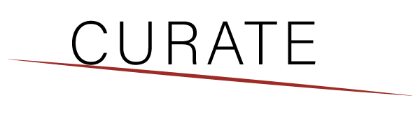
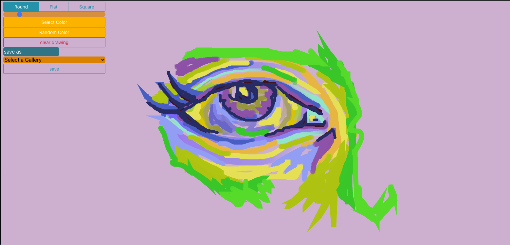

# Curate

### Date 4/12/2021

#### By: Siobahn Schuck

[website](https://www.siobahnschuck.com) |
[vimeo](https://www.vimeo.com/siobahnschuck)
| [linkedIn](https://www.linkedin.com/in/siobahnschuck/) |
[gitHub](https://github.com/siobahnschuck)

---

### **_Description_**

 
A digital art gallery created by it's users.

Curate allows the user to create drawings in their "studio", save them to their profile, and organize them into an exhibition which can be published and shared with friends. When you aren't creating you can browse other exhibitions, and find collaborators. 

Curate is a social platform based on illustrations.

---

### **_Technologies_**

- REACT 
- Redux
- Javascript, HTML, CSS
- Python
- Flask

---
### **_Getting Started_**

To view my Trello board click [here](https://trello.com/b/MXSFGhnY/capstone-cavemind-curate)
otherwise click [here]() to check out the deployed site.

---

## **_Application Images_**

### Final Design
 

### Original Concepts

---

### **_Future Updates_**

- [ ] Select a cover image for your gallery
- [ ] profile theme colors
- [ ] extended drawing tools!
- [ ] 3D gallery space
- [ ] Share to other social media sites
- [ ] Collaboratively draw with friends
- [ ] Comment, save, and like other galleries 
- [ ] Chat with other artists that you follow 

---

### **_Credits_**
Inspiration: 
Google's World Draw: [World Draw](https://world-draw.appspot.com/draw)

Technical: 
react-icons: [react icons](https://react-icons.github.io/react-icons)
react-color: [react color](https://www.npmjs.com/package/react-color)
AWS Image Hosting: [aws s3](https://aws.amazon.com/)
